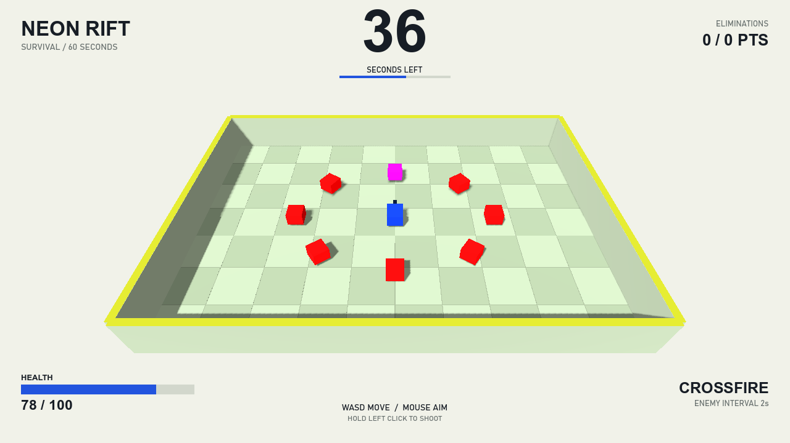
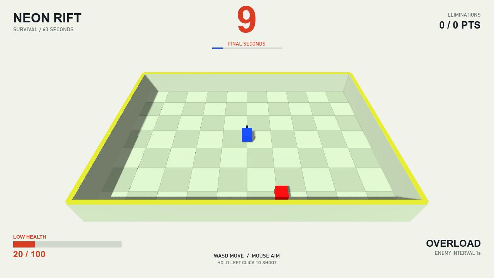

# Member B 完整本地审阅包

本轮已把用户选定的明亮街机风格写入 [视觉规范](../../VISUAL_STYLE.md)，并按 [实施计划](../../WENG_YUXUAN_MEMBER_B_IMPLEMENTATION_PLAN.md) 补齐可在本机完成的内容。制作没有使用任何skills；用户已授权通过功能分支推送，主分支合并留待PR审查。

## 本轮完成

| 项目 | 交付 |
| --- | --- |
| 视觉规范 | 明确颜色、字号、布局、窗口适配、光照与各种状态表现 |
| 统一实现 | SurvivalVisualStyle统一HUD、竞技场与玩家的视觉参数 |
| 警告显示 | 低生命值、最后10秒、两者同时出现，以及重启恢复 |
| 本机验收 | 生存83项、刷怪272项、图形窗口27项，合计382项；[T01–T16记录](ACCEPTANCE.md) |
| 平衡记录 | 四组正常物理试跑；[结果与参数决策](../../BALANCE_REVIEW.md) |
| 演示材料 | 真实完整生存、自然失败、两次GUI重启，约80.27秒MP4 |
| 构建 | 0警告、0错误；清理了原Bullet3D的可空上下文警告 |

## 演示视频

[打开MP4演示](survival-demo.mp4)

1280×720，30FPS，约80.27秒，约1.14MiB。输入由脚本巡逻提供，游戏时间、移动、刷怪、敌人行为、弹丸与伤害由实际游戏逻辑推进。首轮没有停止敌人、修改玩家数值或手动跳到60秒。

| 视频位置 | 内容 |
| --- | --- |
| 0–60秒 | 正式60秒生存，移动并射击，敌人持续生成与难度增长 |
| 约60–63秒 | 胜利、35击杀、4620分，结算冻结 |
| 约63秒 | 第一次实际按钮重启，时间和生命值恢复 |
| 约63–74秒 | 不操作的新一局，被敌人正常攻击直至自然失败 |
| 约74–77秒 | 失败结果，存活约11.2秒 |
| 约77–80秒 | 第二次按钮重启，恢复正常游戏 |

采用 [Godot Movie Maker](https://docs.godotengine.org/en/stable/tutorials/animation/creating_movies.html) 的固定帧率录制，再转换为H.264 MP4。视频没有添加音乐，原游戏没有制作声音。它是脚本操作的实际游戏演示，不是人工难度测试。

## 状态效果图

正常进行：

最后10秒与低生命值同时出现：

其余：[开局](01-start.png)、[胜利](03-victory.png)、[失败](04-defeat.png)、[重启](05-restarted.png)、[960×540](06-compact-window.png)、[低生命值](07-low-health.png)、[最后10秒](08-final-seconds.png)、[960×720](10-four-three-window.png)、[4:3结算](11-four-three-result.png)。

静态截图通过独立场景预设时间、伤害与敌人位置，主要用于审阅界面；视频采用连续正常游戏。二者的取证方式分别注明。

## 玩家参数

保留100最大生命值、速度7、射速5、0.6秒受伤无敌。自动瞄准并射击可完整生存；本次只移动的路线在约35秒失败，原地不操作约11秒失败。候选速度6没有提供足够理由替换7。人工试玩后再决定是否调整HP或速度。

## 本机运行

在项目根目录PowerShell执行 `./Run-Local.ps1`。也可以在Godot .NET导入 `project.godot`，构建后运行 `Scenes3D/Main3D.tscn`。

常驻操作为WASD移动、鼠标瞄准、左键射击；结果界面点击PLAY AGAIN。HUD控件仍由C#构建，运行后可在Remote场景树查看。

## 审阅与剩余外部工作

先审阅视觉规范、两种警告画面与完整视频，再试玩移动射击和重启。成果按功能分支提交，双机验证、人工难度评估、PR审查及主分支合并保留为待办。

原始AVI与视频转换工具保存在本机辅助目录；仓库审阅包只保留较小的MP4，转换工具不是游戏依赖。
