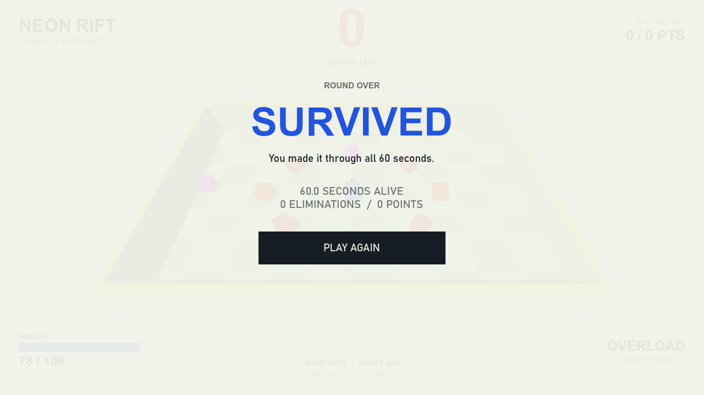
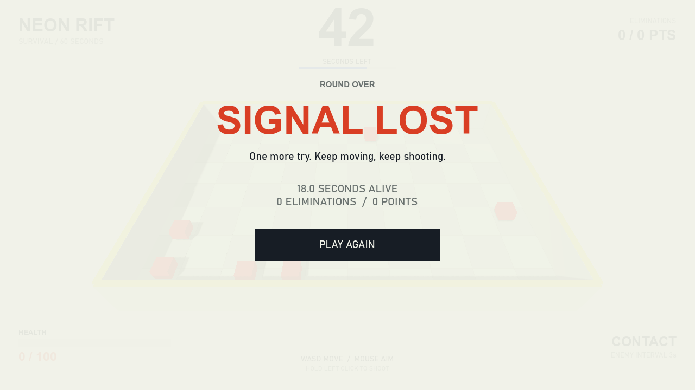

# Neon Rift 3D：重新制作的本地审阅稿

此文档保存重新设计阶段的审阅记录，制作未使用任何skills。当前交付与验收以[完整审阅包](../2026-10-11-complete/README.md)为准。

尚未收到新的风格选择时，先按“明亮街机”方向制作：浅色背景、淡绿色棋盘竞技场、蓝色玩家、柠檬黄色边缘。界面把倒计时放在顶部中央，生命值放在左下角，得分放在右上角，难度阶段放在右下角。胜负使用全屏结算画面。

## 当前效果

进行中，剩余36秒、生命值78：

胜利：

失败：

其他图片：[开局](01-start.png)、[重启](05-restarted.png)、[960×540窗口](06-compact-window.png)。

图片来自真实 Godot 主场景的GPU视口。截图测试场景预设了时间、伤害和敌人位置，用来展示界面状态；不是人工通关录像。

## 本轮修改

| 文件 | 修改内容 |
| --- | --- |
| `Scripts3D/SurvivalHud.cs` | 重新编写HUD布局、字体、颜色与结算界面；保留原有事件订阅和重启入口 |
| `Scripts3D/ArenaPresentation3D.cs` | 棋盘地面、明亮环境、角色阴影和新的场地边缘 |
| `Scenes3D/Player3D.tscn` | 玩家改为蓝色，朝向标记改为深色；碰撞与参数保留 |
| `project.godot` | 浅色背景 |

计时、胜负、刷怪、玩家操作和重启逻辑沿用已经验证的实现。最大生命值100、速度7、射速5仍使用原版参数。

## 本轮验证

- C#构建成功，0错误；原有 `Bullet3D.cs` 的1个CS8632警告仍在。
- 生存模式集成检查74项通过，含移动、射击、鼠标瞄准、血量显示、胜负、GUI重启和连续复位。见 [运行日志](survival-test.log)。
- 导出6张截图，并检查主界面、胜利、失败与小窗口布局；修正了倒计时标签间距和地面过亮问题。
- 上一轮的60秒实时计时、自动战斗和272项刷怪检查作为功能基线保留；本轮没有将这些历史结果冒充新的测试执行。

本机启动方法仍为项目根目录 `Run-Local.ps1`，或用Godot .NET运行 `Scenes3D/Main3D.tscn`。

已否决的旧视觉稿与代码备份保留在本机，不纳入当前交付。
